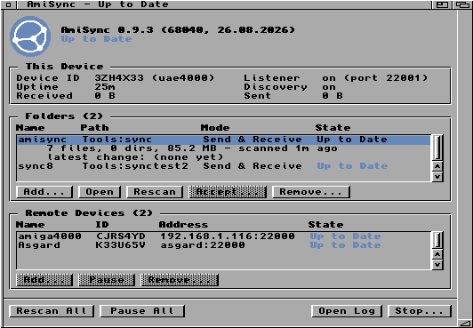
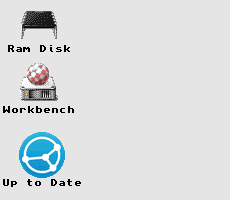
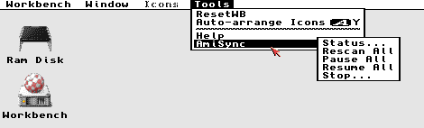

# AmiSync

[](LICENSE)


A [Syncthing](https://syncthing.net/)-compatible file synchronization daemon
for **AmigaOS 3.x** (68020 and up).

[Syncthing](https://syncthing.net/) keeps folders in sync between two or
more computers: save, change or delete a file on one machine and the same
thing happens on the others, over an encrypted connection, with no cloud
account in the middle. It runs on Windows, macOS, Linux and phones.

AmiSync brings this to the classic Amiga. It speaks Syncthing's native
protocol (the Block Exchange Protocol over TLS 1.3, via
[AmiSSL](https://github.com/jens-maus/amissl)), so the Amiga appears as just
another device in your Syncthing setup, and a folder on the Amiga stays
mirrored with a folder on any of your other machines.

AmiSync is an independent project, not affiliated with or endorsed by
Syncthing.



*The status window: this device, the shared folders and the remote devices, each
with its live state. Selecting a row expands it — here the `amisync` folder,
showing what it holds and when it was last scanned.*



*AmiSync on Workbench 3.2 — the AppIcon's label is the live sync status. Double-click the icon to open the window above.*



*AmiSync's commands in Workbench's Tools menu.*

## Contents

- [Status](#status)
- [Features](#features)
- [Requirements](#requirements)
- [Installing](#installing)
- [First-time setup](#first-time-setup)
- [Running](#running)
- [Building from source](#building-from-source)
- [Third-party content](#third-party-content)
- [Credits](#credits)
- [License](#license)

## Status

AmiSync syncs files both ways with current Syncthing (v2.x): TLS 1.3
connections (dialling out or accepting inbound), deletions, directories,
`.stignore`, per-block SHA-256 verification, conflict copies, rename/copy
detection, local discovery, LZ4 message compression, and a persistent
per-folder index that survives restarts without re-hashing.

Limits: a folder tree nests at most **12 levels** deep; entries deeper than
that are skipped. There is no fixed cap on the number of entries — the
per-folder index grows as needed, so folder size is bounded by RAM.

Not supported: global discovery and relays (peers must be directly
reachable — same LAN or a dialable address), symlinks,
receive-encrypted/untrusted peers, and per-device folder sharing — every
configured folder is offered to every configured peer.

### A note on receive-only folders

A `receiveonly` folder is a **mirror**, and it is worth knowing exactly what
that means before you put one somewhere you work:

- Files you **create** there stay there. AmiSync never announces them and never
  removes them.
- Files that **arrived from the peer** are the peer's. If you edit one, the
  peer's copy replaces your edit at the next scan — that is what keeps a mirror
  a mirror, since this mode has no way to send your change back.

Your edit is not thrown away: the copy being replaced is moved to the folder's
`.stversions` drawer first, whether or not `versioning` is turned on, and the
log says so by name. Copy it back out if you wanted it.

If you intend to edit files in a folder, use `sendreceive` instead.

## Features

- Send-receive, send-only and receive-only folders, synced with ordinary
  Syncthing peers over BEP / TLS 1.3 (AmiSSL), with the connection pinned
  to the configured device ID
- Persistent per-folder block index: a restart re-uses stored hashes
  instead of re-reading every file
- Near-instant pickup of local changes: filesystem notification triggers a
  scan seconds after a drawer changes, with a periodic scan as the backstop
  (it catches in-place edits, which change no drawer, and filesystems
  without notification support)
- `.stignore` patterns, Syncthing-style conflict copies, and rename/copy
  detection (content already present locally is copied on disk instead of
  re-downloaded)
- Optional file versioning (`versioning = yes`): a file a remote change would
  overwrite or delete is first moved to a `.stversions` drawer, so a mistaken
  delete elsewhere is recoverable (Syncthing's "trash can" mode)
- Local peer discovery and runtime peer adding, from the status window's
  Remote Devices list or via ARexx `ADDPEER`
- Workbench integration: a status AppIcon on the backdrop, daemon commands
  in the Tools menu, and the live status in `ENV:amisync/status`
- Scriptable control via an ARexx port (`AMISYNC`)

## Requirements

- AmigaOS 3.x on a 68020 or better, no FPU needed; expect slower TLS
  handshakes below a 68040
- [AmiSSL](https://github.com/jens-maus/amissl/releases) 5.x installed
- A running TCP/IP stack providing `bsdsocket.library` (Roadshow, AmiTCP or
  Miami)
- About 4 MB is the working minimum for one folder and a peer or two.

## Installing

Download the latest `amisync-<version>.lha` from the
[Releases](../../releases) page and extract it on the Amiga, then double-click
**Install**. From a Shell, `Installer Install` does the same.

The installer picks the build for your CPU, copies `amisync` and
`amisync-genid` into your command path (default `C:`), installs the
Workbench icon, seeds `S:amisync.conf` (an existing config is left
untouched), creates this device's identity if AmiSSL is installed and none
exists yet, and can add AmiSync to `S:User-Startup` so it starts at every
boot.

Prefer to compile it yourself? See [BUILDING.md](BUILDING.md).

## First-time setup

These steps use the status window, and work for a peer on the same LAN.
One anywhere else has to be added in the config file — see below.

1. **Start AmiSync** — or just reboot, if the installer added it to
   `User-Startup`. An AmiSync AppIcon appears on the Workbench backdrop;
   double-click it to open the status window.

2. **In Syncthing, add the Amiga and share a folder with it.** On the same LAN
   the Amiga now appears in Syncthing's "Add Remote Device" suggestions, pick
   it, then share a folder with it.

   If you need the full device ID run `amisync-genid SHOWID`.

3. **Back on the Amiga, add the Syncthing device.** On the same LAN it
   appears in the status window's Remote Devices list as **Discovered**.
   Select it and press **Add...**

   AmiSync only ever connects to peers you add — nothing is accepted
   automatically, and the device ID pins the TLS connection, so a peer
   presenting any other certificate is rejected.

4. **Accept the folder it shares.** Once that peer connects, the folder appears
   in the Folders list as **Offered**. Select it and press **Accept...**, then
   choose or name the drawer to keep it in.

Syncing starts as soon as the folder is accepted.

> **Every folder is offered to every peer.** Unlike Syncthing, AmiSync has no
> per-device folder sharing: a device you add can request any file in any
> configured folder. Add only devices you would give all of those folders to,
> and keep anything you would not on a separate machine.

### Peers that aren't on the LAN

Discovery only reaches the local network, so a peer anywhere else has to be
given an address. That is done in `S:amisync.conf`:

```
; the other device's Syncthing ID and address:
peer = P56IOI7-MZJNU2Y-IQGDREY-DM2MGTI-MGL3BXN-PQ6W5BM-TBBZ4TJ-XZWICQ2 192.168.1.50:22000

; folder id (must match the id in Syncthing), local path, mode:
folder = amisync Work:Sync sendreceive
```

Copy the folder id from its settings in Syncthing. ARexx `ADDPEER` and
`ADDFOLDER` do the same at runtime and persist it.

[`config/amisync.conf.example`](config/amisync.conf.example) documents every
option.

## Running

```sh
amisync                  # starts and detaches into the background
amisync NODETACH         # stay in the foreground
```

### Workbench

While running, AmiSync shows an AppIcon on the Workbench backdrop whose
label is the live sync status ("Up to Date", "Syncing (3 files)",
"Offline") — double-click it for a live status window where folders and
devices can be added, opened, rescanned, paused and removed, with
per-folder and per-device sync state (the AmigaGuide manual has the full
tour). Its commands also appear in Workbench's Tools menu. Set
`appicon = no` to turn off both the icon and the menu.

### ARexx control

Everything can also be scripted through an ARexx port named `AMISYNC`:

| Command | Effect |
|---------|--------|
| `STATUS`  | returns a sectioned report (this device: uptime + traffic totals; folders: files/size + last scan; remote devices: state, identity, traffic) in `RESULT` |
| `DISCOVERED` | returns the unconfigured devices seen on the LAN via local discovery (device ID + address), for review; amisync never connects to them on its own |
| `ADDPEER <id> [host[:port]]` | add a device as a sync peer at runtime and append a `peer` line to `S:amisync.conf`. With a host it is dialled right away; with the ID alone it waits to be found by local discovery |
| `ADDFOLDER <id> <path> [mode]` | add a folder at runtime and append its config line — the drawer is created if needed, scanned, then offered to every configured peer; `mode` is `sendreceive` (default), `sendonly` or `receiveonly` |
| `REMOVEFOLDER <id>` | stop syncing a folder and remove its config line — local files stay, peers keep their copies |
| `RESCAN`  | re-scan all folders now and announce any local changes (normally automatic: filesystem notification within seconds, plus a periodic ~60 s scan) |
| `PAUSE [id]`  | stop dialling all peers, or just one — `id` must be the peer's full device ID, not the short prefix STATUS shows |
| `RESUME [id]` | resume dialling all peers, or just the one device `id` (full ID, as above) |
| `LOGLEVEL [debug\|info\|warn\|error]` | set the log verbosity, or return the current level with no argument |
| `VERSION` | returns the version string |
| `HELP`    | returns the command list |
| `QUIT`    | stop the daemon cleanly |

On the Amiga itself, the installed **amisync.guide** (an AmigaGuide manual)
covers all of the above in native hypertext — open it with MultiView, or from
a Shell with `MultiView C:amisync.guide`.

## Building from source

See [BUILDING.md](BUILDING.md) for the cross-compilation toolchain, build
targets, tests and packaging.

## Third-party content

AmiSync is MIT licensed (see [LICENSE](LICENSE)). Two things in this
repository are not, and keep the licences their authors gave them: the
vendored **LZ4** compressor (BSD 2-Clause) and the **Syncthing logo** together
with the Amiga icons converted from it (MPL-2.0). Every affected file is
listed in [THIRD-PARTY.md](THIRD-PARTY.md).

Syncthing is a trademark of the Syncthing Foundation. AmiSync is an
independent project, not affiliated with or endorsed by Syncthing.

## Credits

Developed with assistance from [Claude](https://claude.com/claude-code) (Anthropic)

Tested using [amimcp](https://github.com/thomas-luebker/amimcp) (Thomas Luebker)

## License

MIT — see [LICENSE](LICENSE).
Copyright (c) 2026 Thomas Severinsen

The third-party content listed above keeps its own licenses.
